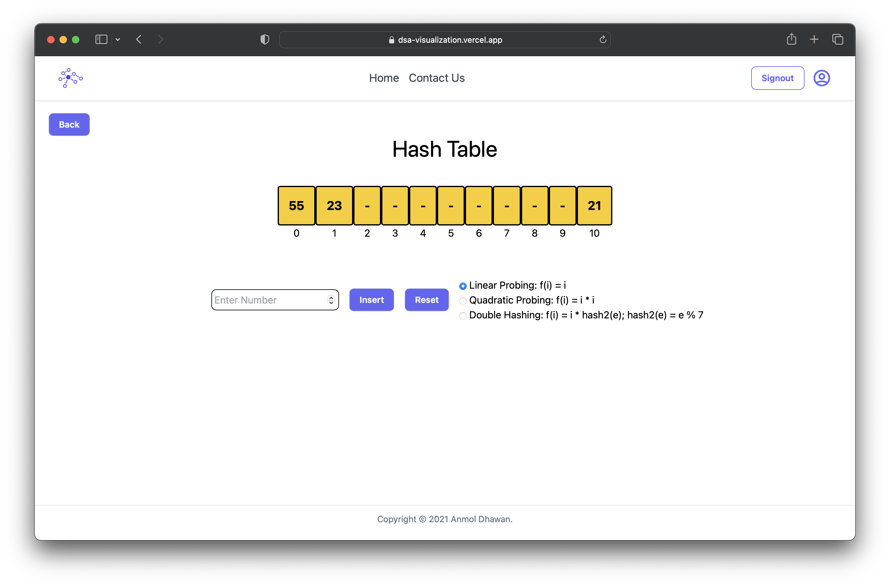

      

<!-- PROJECT LOGO -->
<br />
<div align="center">
  <a href="https://github.com/othneildrew/Best-README-Template">
    
  </a>

  <h3 align="center">DSA Visualizer</h3>

  <p align="center">
    Learning Portal for students and teachers

</div>

<!-- ABOUT THE PROJECT -->

## About The Project

<div align="center">

</div>

There are many great README templates available on GitHub; however, I didn't find one that really suited my needs so I created this enhanced one. I want to create a README template so amazing that it'll be the last one you ever need -- I think this is it.

<!-- GETTING STARTED -->

## Getting Started

This is an example of how you may give instructions on setting up your project locally.
To get a local copy up and running follow these simple example steps.

### Prerequisites

This is an example of how to list things you need to use the software and how to install them.

- npm
  ```sh
  npm install npm@latest -g
  ```

### Installation

1. Clone the repo
   ```sh
   git clone https://github.com/umangraval/DSA-Visualizer.git
   ```
2. Install NPM packages
   ```sh
   npm install
   ```
3. Rename `.env.sample` to `.env.local`
4. To start the project locally
   ```sh
   npm start
   ```
5. Go to your browser and type http://localhost:3000
